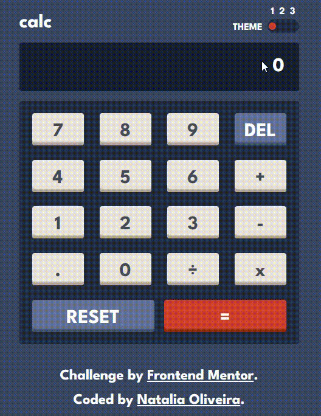

# Frontend Mentor - Calculator app solution
| :placard: Vitrine.Dev |     |
| -------------  | --- |
| :sparkles: Name | **Calculator App**
| :label: Build with | html, css, js
| :rocket: URL  | http://calculator-app-rose-five.vercel.app
| :fire: Challenge     | https://www.frontendmentor.io/challenges/calculator-app-9lteq5N29


## Table of contents
- [Overview](#overview)
  - [The challenge](#the-challenge)
- [My process](#my-process)
  - [What I learned](#what-i-learned)
  - [Continued development](#continued-development)
- [Acknowledgments](#acknowledgments)
- [Author](#author)


## Overview
This is a solution to the Calculator app challenge on Frontend Mentor. 


<br>


### The challenge

Users should be able to:

- See the size of the elements adjust based on their device's screen size
- Perform mathmatical operations like addition, subtraction, multiplication, and division
- Adjust the color theme based on their preference
- **Bonus**: Have their initial theme preference checked using `prefers-color-scheme` and have any additional changes saved in the browser

## My process
Since the challenge had more than one theme, I decided not to use a framework, to challenge myself even more.

1. Creation of HTML structure
    1.1 Used data-attribute as main querySelector 
2. CSS style
    2.1 Used variables to easily change according to theme selection 
    2.2 Used grid to display the keypad
    2.3 Creation of media query to adjust mobile layout 
3. Javascript Logic
    3.1 Created object to store themes and as the theme toggle is clicked
    3.2 Added Event Listener to keypad buttons
    3.3 Created conditional logic to avoid incoherent input

### What I learned
* __Theme Toggle__ :  how to change variables created in css via 
```
document.documentElement.style.setProperty(variableName, newValue)
```

### Continued development
* __JS logic__ : I really liked the challenge to figure out a logic to set up all the mathemetical operations with valid inputs  
* __Theme Toggle__ : It was my first time changing themes without a framework, so I would like to explore more alternatives


## Acknowledgments
- [3 state toggle](https://webcodespace.com/how-to-create-a-three-state-toggle-switch-using-html-css-and-javascript/) - I used this tutorial from Jima Victor as inspiration to create the theme toggle

## Author
- Portfolio - [Natalia Oliveira](https://portfolio-zeta-rose-48.vercel.app)
- Frontend Mentor - [@noliv197](https://www.frontendmentor.io/profile/noliv197)


